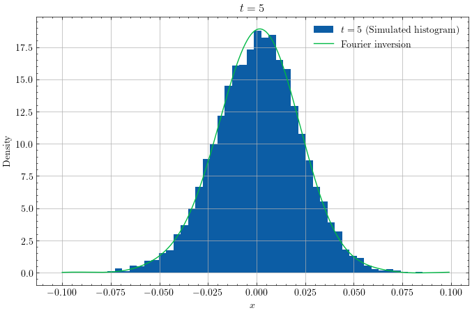

<p align="center">
  
</p>

[](https://www.python.org/downloads/release/python-31111/)
[](https://pylint.pycqa.org/en/latest/)
[](https://docs.astral.sh/ruff/formatter/)

The code allows to calibrate the BGIG distribution introduced in [*The bilateral generalized inverse Gaussian process with applications to financial modeling*](https://arxiv.org/abs/2407.10557) by Gaetano AGAZZOTTI and Jean-Philippe AGUILAR. The calibration is achieved with a moment-based method.

Calibration is done on SP500 index from 2021 to 2023.


## Installation

A script is available for an easy creation of the conda environment and compilation of auxiliary functions:
```bash
$ source install.bash
```

## How to use ? 

A toy example can be ran with:

```bash
$ python main.py
```

## Results

Here is an example of simulated BGIG trajectories. 

<p align="center">
  
</p>

The main application is the calibration to SP500 index (see figure below).
<p align="center">
  
</p>

## Credits

The simulation code for a one-sided GIG distribution was taken from the following [repository](https://github.com/getian107/PRScsx/tree/master). 

## Interesting ? 

If you have any questions, feel free to contact us. We will be more than happy to answer ! 😀

If you use it, a reference to the paper would be highly appreciated.

```
@misc{agazzotti2024bilateralgeneralizedinversegaussian,
      title={The bilateral generalized inverse Gaussian process with applications to financial modeling}, 
      author={Gaetano Agazzotti and Jean-Philippe Aguilar},
      year={2024},
      eprint={2407.10557},
      archivePrefix={arXiv},
      primaryClass={math.PR},
      url={https://arxiv.org/abs/2407.10557}, 
}
```

## Tested on

[](https://www.releases.ubuntu.com/24.04/)
[](https://docs.conda.io/projects/conda/en/24.9.x/)
[](https://www.intel.com/content/www/us/en/products/sku/195436/intel-core-i510210u-processor-6m-cache-up-to-4-20-ghz/specifications.html)

